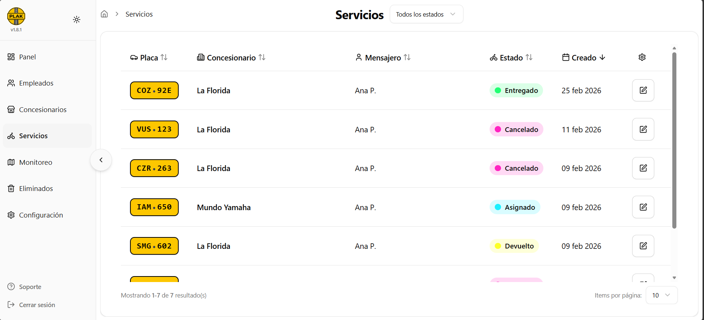
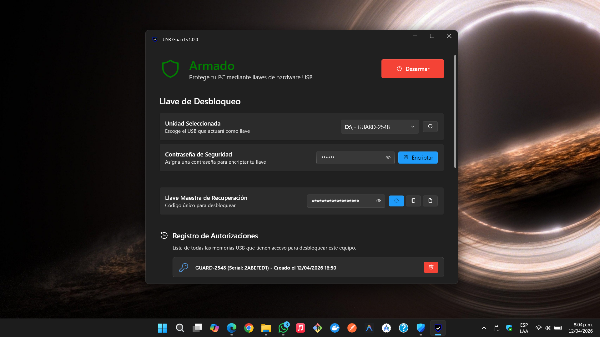

 

## Proyectos Destacados

<table bordercolor="#30363d">
  <tr>
    <td width="50%" valign="top">
      <h3 align="center">PLAK</h3>
      
<b>Planificación y gestión de recursos empresariales</b>

      

        
        
      

       
      
Sistema completo de trazabilidad empresarial. Actualmente <b>implementado y en producción en la Secretaría de Movilidad (Tránsito de Sabaneta)</b> manejando servicios críticos con alta concurrencia y seguridad.

      

        
      

    </td>
    <td width="50%" valign="top">
      <h3 align="center">USB Guard</h3>
      
<b>Sistema de seguridad Zero-Trust</b>

      

        
        
      

       
      
Software de seguridad local que transforma memorias USB estándar en llaves criptográficas físicas de hardware. Cuenta con encriptación nativa y protección activa contra ataques por fuerza bruta (Brute-Force).

      

        
      

    </td>
  </tr>
</table>

 

## Arsenal Tecnológico

  <table>
    <tr>
      <td align="center" width="25%">
        <b>Arquitectura & Backend</b>  
         
         
         
         
        
      </td>
      <td align="center" width="25%">
        <b>Frontend & Mobile</b>  
         
         
         
         
        
      </td>
      <td align="center" width="25%">
        <b>Ciberseguridad & OS</b>  
         
         
         
         
        
      </td>
      <td align="center" width="25%">
        <b>Cloud & Herramientas</b>  
         
         
         
         
        
      </td>
    </tr>
  </table>

 

## Actividad

   
  <picture>
    <source media="(prefers-color-scheme: dark)" srcset="https://raw.githubusercontent.com/fttmatteo/fttmatteo/output/snake.svg">
    <source media="(prefers-color-scheme: light)" srcset="https://raw.githubusercontent.com/fttmatteo/fttmatteo/output/snake.svg">
    
  </picture>

 

  

