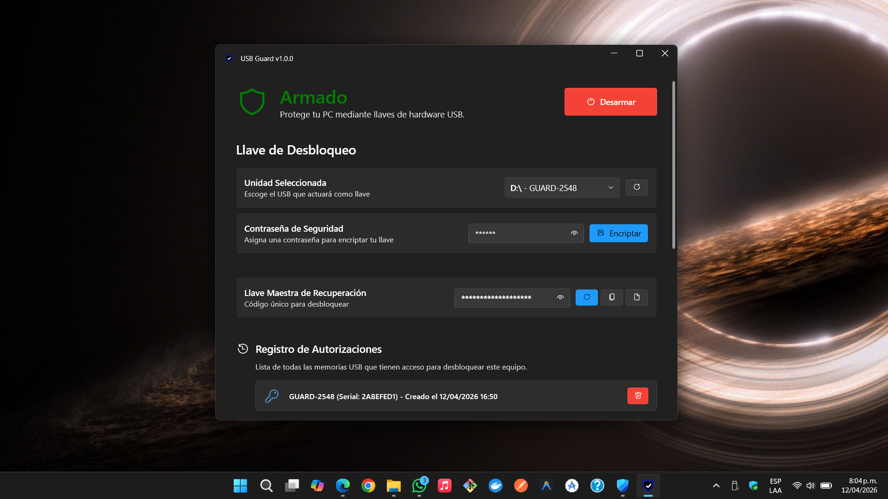
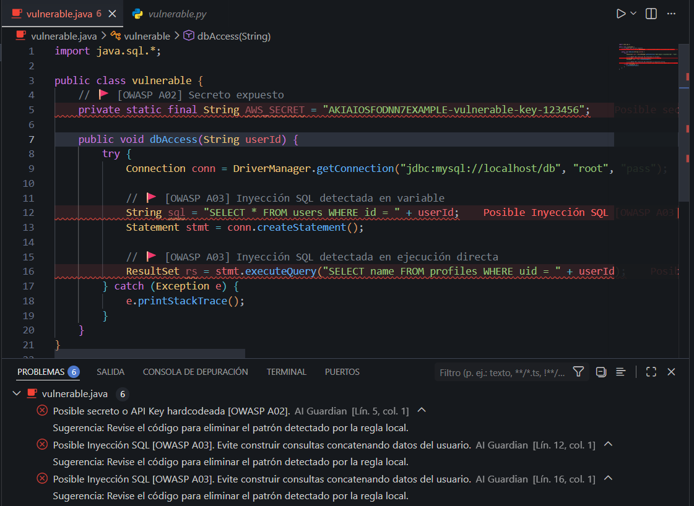
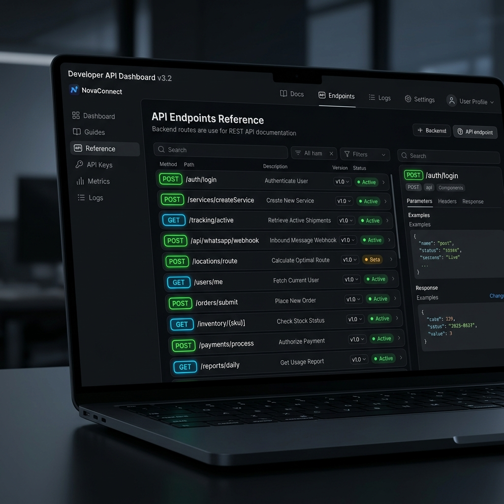
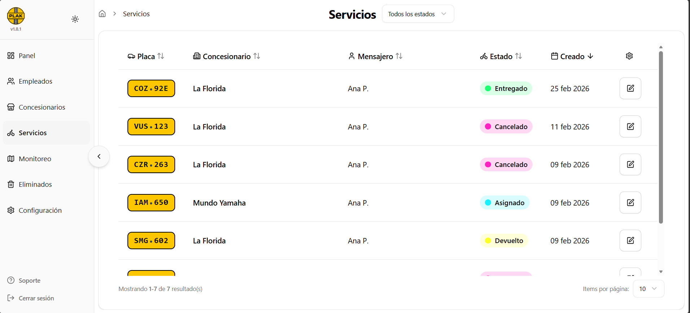
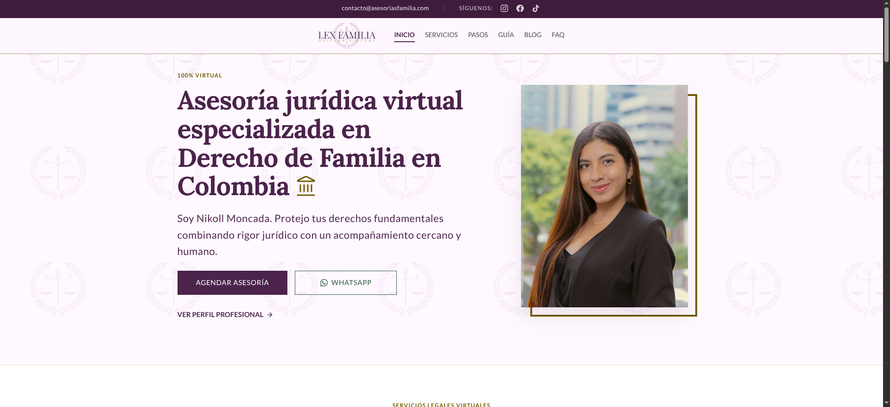

 

## Proyectos

<table bordercolor="#30363d">
  <tbody>
    <tr>
      <!-- PROYECTO 1: USB GUARD -->
      <td width="50%" valign="top">
        
<b><big>USB Guard</big></b>

        
<b>Sistema de seguridad Zero-Trust</b>

        

          
          
          
        

         
        
Proyecto de desarrollo enfocado en seguridad local que transforma memorias USB estándar en llaves criptográficas físicas de hardware. Cuenta con control de sistema a bajo nivel (Win32), encriptación nativa y protección activa contra ataques por fuerza bruta.

        
🏆 <b>Galardonado con Insignia en SourceForge</b> y respaldado por más de <b>800 descargas</b>.

        

          
        

      </td>
      <!-- PROYECTO 2: AI GUARDIAN -->
      <td width="50%" valign="top">
        
<b><big>AI Guardian</big></b>

        
<b>Auditor de Código Asistido por IA</b>

        

          
          
        

         
        
Extensión publicada en el Marketplace de Visual Studio Code para auditar vulnerabilidades en tiempo real, enfocada en código generado por IA. Combina un motor local determinista ultrarrápido con un auditor LLM para escaneos semánticos profundos y contextuales.

         
        

          
        

      </td>
    </tr>
    <tr>
      <!-- PROYECTO 3: MESSENGER BACKEND -->
      <td width="50%" valign="top">
        
<b><big>Messenger Backend</big></b>

        
<b>Sistema Logístico y Monitoreo Satelital</b>

        

          
        

         
        
Backend robusto y concurrente construido en Java con Spring Boot bajo los estrictos principios de <b>Arquitectura Hexagonal</b>. Expone una API REST segura, sockets (Redis) para tracking GPS en tiempo real de flotas y automatización interactiva mediante un bot oficial de WhatsApp API.

        

          <a href="https://github.com/fttmatteo/messenger-backend">
            <!-- [INDICADOR] PON AQUÍ LA RUTA A TU CAPTURA DE PANTALLA DE MESSENGER BACKEND -->
            
          </a>
        

      </td>
      <!-- PROYECTO 4: MESSENGER FRONTEND -->
      <td width="50%" valign="top">
        
<b><big>Messenger Frontend</big></b>

        
<b>Panel Web y App Nativa (Android)</b>

        

          
          
        

         
        
Aplicación de alto rendimiento orientada a la logística. Panel de administración web para visualizar flotas en tiempo real, junto a una app nativa Android optimizada para transportistas con ejecución de tareas en segundo plano (Foreground Services) para telemetría constante.

        

          <a href="https://github.com/fttmatteo/messenger-frontend">
            <!-- [INDICADOR] PON AQUÍ LA RUTA A TU CAPTURA DE PANTALLA DE MESSENGER FRONTEND -->
            
          </a>
        

      </td>
    </tr>
    <tr>
      <!-- PROYECTO 5: LEX FAMILIA -->
      <td width="50%" valign="top">
        
<b><big>Lex Familia</big></b>

        
<b>Plataforma LegalTech de Alta Conversión</b>

        

          
          
        

         
        
Aplicación web B2C de asesoría jurídica virtual. Construida con un enfoque obsesivo en <b>SEO técnico, accesibilidad y rendimiento extremo</b>. Implementa un diseño premium responsivo, micro-interacciones y datos estructurados (JSON-LD) para dominar el posicionamiento orgánico en el nicho legal.

        

          <a href="https://asesoriasfamilia.com/">
            <!-- [INDICADOR] PON AQUÍ LA RUTA A TU CAPTURA DE PANTALLA DE LEX FAMILIA -->
            
          </a>
        

      </td>
      <!-- ESPACIO VACÍO / PRÓXIMAMENTE -->
      <td width="50%" valign="middle" align="center">
        
<b><big>¡Próximamente!</big></b>

        
Más proyectos en desarrollo...

        

          
        

      </td>
    </tr>
  </tbody>
</table>

 

## Arsenal Tecnológico

  <table>
    <tbody>
      <tr>
        <td align="center" width="25%">
          <b>Arquitectura & Backend</b>  
         
         
         
         
        
      </td>
      <td align="center" width="25%">
        <b>Frontend & Mobile</b>  
         
         
         
         
        
      </td>
      <td align="center" width="25%">
        <b>Ciberseguridad & OS</b>  
         
         
         
         
        
      </td>
      <td align="center" width="25%">
        <b>Cloud & Herramientas</b>  
         
         
         
         
        
      </td>
      </tr>
    </tbody>
  </table>

 

## Actividad

  
  

   
  <picture>
    <source media="(prefers-color-scheme: dark)" srcset="https://raw.githubusercontent.com/fttmatteo/fttmatteo/output/snake.svg">
    <source media="(prefers-color-scheme: light)" srcset="https://raw.githubusercontent.com/fttmatteo/fttmatteo/output/snake.svg">
    
  </picture>

 

  

